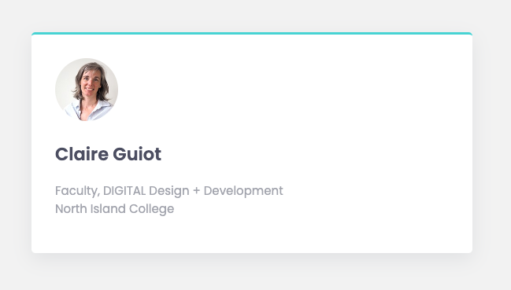
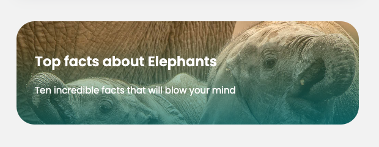
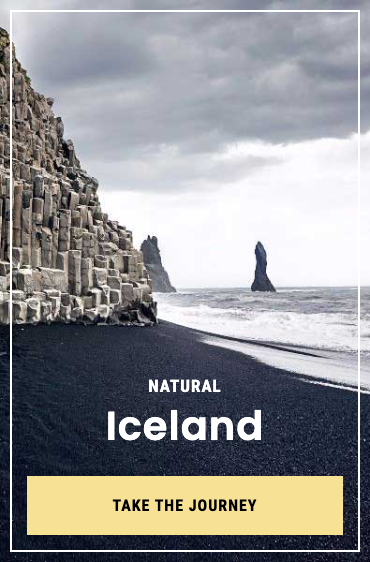

# Exercise 5

## Objectives
Practice working with the CSS box model to create some typical card layouts.

## Instructions
Remember to:
* Regularly save your files and check out what your web page looks like in a web browser.
* Make regular commits and pushes.
### Get set up
* Clone your remote exercise repository onto your local machine.
* Add a comment in the head element of the homepage including: the course code and your section number - your name - Exercise 5. Example:
```
<!-- DGL 103 CVS1 - your name - Exercise 5 -->
```
Note: You don't need to edit any of the provided HTML content to complete this exercise. You may need to add links to Google Fonts in the head element.
### Card 1:
In VS Code, add the following styles to the article element with the class name card-one:
   * Use the Google Font called Poppins and use the rem unit to define all your fonts sizes.
   * Make the image round by using the border-radius property.
   * Give the card a background colour of `hsl(0, 0%, 100%)`.
   * Make the width of the card 500px.
   * Give the card a 50px margin on all four sides so that it isn't so close to the browser window's edges.
   * Give the card 30px of padding on all four sides so that the content doesn't touch the edges of the card.
   * Round the corners of the card by a 5px radius.
   * Give the card a top border that is 3px thick, solid in style and of the color `hsl(180, 62%, 55%)`.
   * Give the card a shadow. Go to https://getcssscan.com/css-box-shadow-examples to find a pleasing shadow.
 When you are finished the card should look like this: <br />
 

### Card 2:
Add the following styles to the article element with the class name card-two:
   * Give the card the same margin and padding as card one.
   * Change the width of card so that it matches the visual width of card one.
   * Round the corners of the card by a 30px radius.
   * Make the card's h2 and p elements white;
   * Add a gradient and image using the background-image property:
      * Add a gradient to the card's background. Go to https://cssgradient.io/ to create a gradient that you like.
      * Combine your gradient with a background image: Use the elephant image available in the images folder add it to the background-image property after the gradient - don't forget the comma in between the two. <br/>
      Ex: `background-image: linear-gradient(356deg, rgba(34,193,195,1) 0%, rgba(253,187,45,0.022846638655462215) 100%), url('images/elephants.jpeg');`
      * Try out different background-size values until you find one that fits the provided example: https://developer.mozilla.org/en-US/docs/Web/CSS/background-size.
 When you are finished, the card should look like this: <br />
 

### Card 3:
Add the styles to the article element with the class name card-three. The background image is provided in the images folder. The Google fonts are Poppins and Roboto Condensed. Be as exact as you can with your styling, pixel-perfect if possible.<br />


### Card 4:
Add the styles to the article element with the class name card-four. The visual width should be the same as card three. The background image is provided in the images folder. The Google fonts are Poppins and Roboto Condensed. Be as exact as you can with your styling, pixel-perfect if possible. Note that the small text above the headline is not a button.<br />


### Format, organize and add comments 
* Use the Prettier VSCode extension to format your code.
* Add organizational CSS comments and order your style rules so that your CSS is easy to read.
* Add a few comments to explain your HTML and CSS code and highlight anything of interest.

### Check for errors
Use the VSCode HTMLHint extension and validate your code to make sure that it is correct(https://validator.w3.org/#validate_by_upload for HTML, https://jigsaw.w3.org/css-validator/ for CSS).

### Submit your work
1. Commit your changes.
2. Push your changes to GitHub. 
3. Submit in Brightspace to the "Unit 2 Exercises" assignment and follow the instructions. 
4. If you have been using a lab computer on campus, remember to restart the computer.

## Deadlines
Assignments must be submitted before the end of the week but they will only be graded at the end of every unit. Late assignments will not be accepted and will receive an F. You can complete and submit a contract that allows you to extend the deadline for an assignment but you must email it to your instructor a minimum of 48 hrs before the deadline. Deadline extensions are only allowed for those unplanned, unexpected emergencies that life sometimes throws at us, and they will only be approved by your instructor if you follow the correct process. See the Course Info folder in BrightSpace for more info.